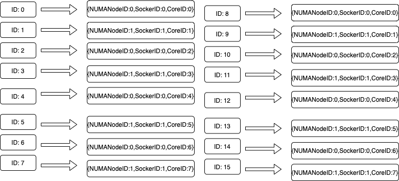
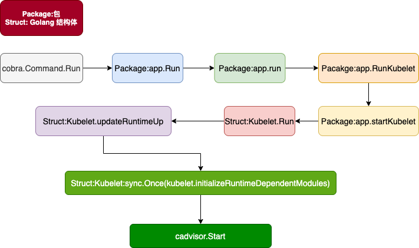
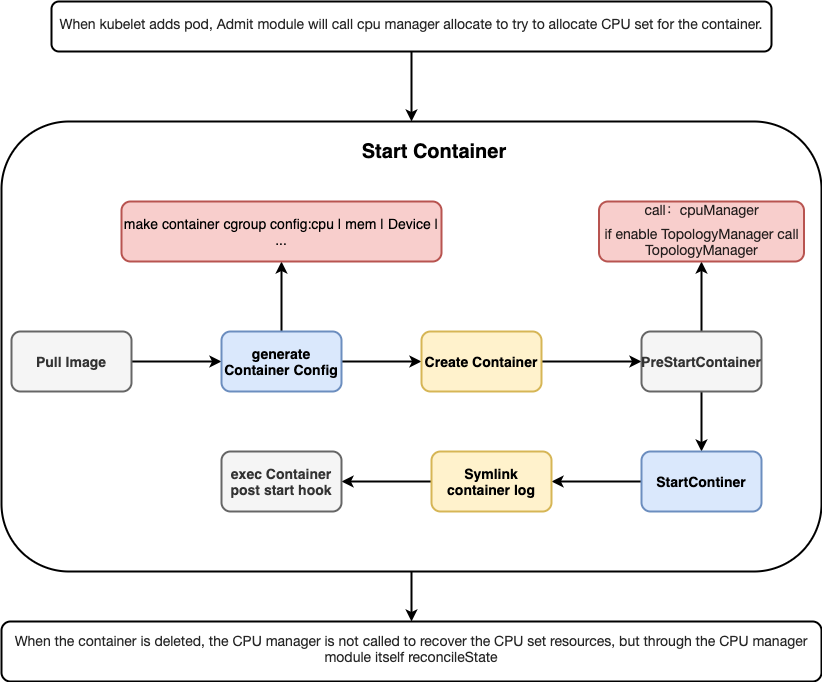
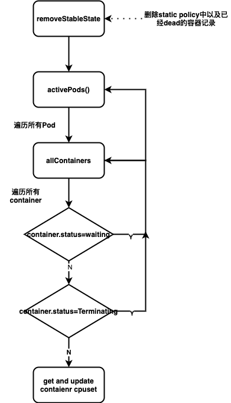

# kubernetes 庖丁解牛：kubelet篇 - CPU Manager

> 摘要：文章kubelet代码角度深度剖析cpu manager的原理。掌握cpu manager模块的功能以及如何同其他模块配合工作。文章中分析的代码为 kubernetes branch release-1.20。

## CPU Manager 是什么

默认情况下，kubelet 创建的 pod 都是使用 CFS 配额的方式使用 CPU 资源的。在这种分配方式下，所有的容器可以使用物理机所有的 cpu 核，并根据申请的 cpu 资源的比例抢占 cpu 时钟周期。CFS 配额的方式对于偏计算的服务，不是特别友好。主要在于进程每次抢占到 cpu 资源后，都会存在上下文切换的问题，以及高速缓存丢失等问题。

cpu manager 提供了一种 cpu set 的 cpu 分配方式。可以将进程尽可能的绑定到同一个 numa 节点上的几个核上运行，减少运行期间的上下文切换。因此如果服务对 cpu throttling、上下文切换、处理器高速缓存丢失、跨插槽的内存访问、需要使用统一物理核的超线程 cpu 敏感的服务，都应该使用 cpu manager。

关于 cpu manager 到底能带来多大的性能提升，可以参考官方给出的一个性能测试结果。.

但是，使用了cpu set并不一定就会带来服务性能的提升。根据之前线上服务的压测显示，在cpu利用率不超过50%的时候，服务使用cpu set带来的性能提升很可观。但流量上涨导致cpu利用率超过50%之后，cpu set带来的性能提升很小。其实这也可以理解，通常线上服务的cpu利用率一般都控制在75%以下，超过75%以后，瓶颈就不再是cpu上下文切换而是CPU本身的性能问题。

## CPU架构存储

###### CPUInfo 记录CPU Topology

```Golang
// CPUDetails is a map from CPU ID to Core ID, Socket ID, and NUMA ID.
type CPUDetails map[int]CPUInfo

// CPUInfo contains the NUMA, socket, and core IDs associated with a CPU.
type CPUInfo struct {
    NUMANodeID int
    SocketID   int
    CoreID     int
}
```


如图所示的CPU Topology,在kubelet CPU Manager中存储的格式如下所示:



有人可能会问，明明图示的CPU Topology只有四个Core,为什么CPU Manager中存储的CPUDetails却有16Core。
搞明白这个问题首先需要了解三个概念：

* 物理CPU数：主板上实际插入的CPU数量，/proc/cpuinfo 文件中出现了几个physical id,则机器上就插入了个物理CPU。如上图所示应该是2个物理CPU。

* CPU核数：单块CPU上面能处理数据的芯片组的数量，如双核、四核等 （cpu cores）。如上图单块CPU的核心数是4.

* 逻辑CPU数：在没有开启超线程技术的情况下：逻辑CPU=物理CPU个数×每颗核数。如果开启了超线程技术就会出现上图所示的情况：逻辑CPU=物理CPU个数×每颗核数x2.超线程技术使在一个实体CPU中，提供两个逻辑线程，每个线程使用起来近似使用一个CPU Core(),也被称为逻辑核.

如上图所示的CPU也是开启了超线程技术,所以CPU Manager中存储的CPUDetails有16Core。

###### ContainerCPUAssignments记录已分配的CPUSet

```Golang
// ContainerCPUAssignments type used in cpu manager state
type ContainerCPUAssignments map[string]map[string]cpuset.CPUSet

// CPUSet is a thread-safe, immutable set-like data structure for CPU IDs.
type CPUSet struct {
    elems map[int]struct{}
}
```

ContainerCPUAssignments按照Pod UID，container name 记录已分配的CPUSet。例如Pod UID为：45efes3467 下的container test1 分配了 0,2。则ContainerCPUAssignments会增加如下记录:

```shell

ContainerCPUAssignments
    key: [45efes3467][test1] value: {key:0,value:{};key:2,value:{}}

```


## CPU 架构发现

kubelet在启动的时候，会先初始化Container Runtime启动时需要依赖的kubelet模块:cadvisor,containerManager,evictionManager,containerLogManager,pluginManager,shutdownManager.其中cadvisor模块主要用于收集、聚合、处理和导出有关正在运行的容器的信息,同时也提供了Node MachineInfo Discover。cadvisor manager提供了MachineInfo()方法,可以获取node节点的机器信息，包括：CPU，Mem，操作系统等。

具体的字段结构如下所示：

```Golang
type MachineInfo struct {
    // The time of this information point.
    Timestamp time.Time `json:"timestamp"`

    // The number of cores in this machine.
    // CPU 逻辑核心数
    NumCores int `json:"num_cores"`

    // The number of physical cores in this machine.
    //CPU 物理核心数
    NumPhysicalCores int `json:"num_physical_cores"`

    // The number of cpu sockets in this machine.
    //CPU 插槽个数
    NumSockets int `json:"num_sockets"`

    // Maximum clock speed for the cores, in KHz.
    //CPU 主频
    CpuFrequency uint64 `json:"cpu_frequency_khz"`

    // The amount of memory (in bytes) in this machine
    //内存容量
    MemoryCapacity uint64 `json:"memory_capacity"`

    // Memory capacity and number of DIMMs by memory type
    MemoryByType map[string]*MemoryInfo `json:"memory_by_type"`

    NVMInfo NVMInfo `json:"nvm"`

    // HugePages on this machine.
    HugePages []HugePagesInfo `json:"hugepages"`

    // The machine id
    MachineID string `json:"machine_id"`

    // The system uuid
    SystemUUID string `json:"system_uuid"`

    // The boot id
    BootID string `json:"boot_id"`

    // Filesystems on this machine.
    //文件系统信息
    Filesystems []FsInfo `json:"filesystems"`

    // Disk map
    //磁盘信息
    DiskMap map[string]DiskInfo `json:"disk_map"`

    // Network devices
    NetworkDevices []NetInfo `json:"network_devices"`

    // Machine Topology
    // Describes cpu/memory layout and hierarchy.
    //CPU和高速缓存布局
    Topology []Node `json:"topology"`

    // Cloud provider the machine belongs to.
    CloudProvider CloudProvider `json:"cloud_provider"`

    // Type of cloud instance (e.g. GCE standard) the machine is.
    InstanceType InstanceType `json:"instance_type"`

    // ID of cloud instance (e.g. instance-1) given to it by the cloud provider.
    InstanceID InstanceID `json:"instance_id"`
}
```

下面是kubelet中启动cadvisor模块的流程:


## CPU 资源管理-CPU Manager

### cpu manager模块工作原理

cpu manager 模块对外提供了一下接口：

```golang
type Manager interface {
    //kubelet 启动时调用启动Start方法启动cpu manager.
    Start(activePods ActivePodsFunc, sourcesReady config.SourcesReady, podStatusProvider status.PodStatusProvider, containerRuntime runtimeService, initialContainers containermap.ContainerMap) error
    //kubelet做准入控制时调用，检查机器上cpu资源是否足够分配给pod。在1.17 版本之前，cpu manager 没有定时的将内存和机器实际分配的cpu core做同步。当用户手动清理了容器后，分配给容器的cpu core资源不会被回收。导致实际机器的cpu core资源是充足的，但是kubelet做准入检查时，提示无法分配到CPU Core，导致Pod启动失败，产生PreStartHookError异常。
    Allocate(pod *v1.Pod, container *v1.Container) error
    //调用runtime运行容器前调用，更新容器cpu set设置。
    AddContainer(p *v1.Pod, c *v1.Container, containerID string) error
    //容器销毁时调用，回收分配出去的cpu set资源。
    RemoveContainer(containerID string) error
    //获取目前机器cpu set分配情况
    State() state.Reader
    //用于和其他模块同步numa拓扑
    GetTopologyHints(*v1.Pod, *v1.Container) map[string][]topologymanager.TopologyHint
}
```



* kubelet watch 到 node新增了一个pod的时候，会对pod做一些准入检查。这些准入检查中就包括了调用cpu manager的Allocate方法尝试为Pod分配cpu sets。
* 准入检查都通过了，kubelet会开始启动pod中container。启动container过程中，在PreStartContainer阶段会通过cpu manager的AddContainer更新container的cpu set。
* 但是在容器销毁时，并没有调用cpu manager的RemoveContainer回收资源。之前版本是有这个调用的，但是在release-1.20中，没有找到该调用。那么现在cpu set的回收就只能完全依赖cpu manager模块自身的reconcileState。

cpu manager 提供了两种策略：none 和 static。

### none cpu manager policy

kubelet 默认的 cpu-manager-policy 是 none，即使用 CFS 配额的方式分配使用 cpu 资源。在容器启动前根据如下规则计算cpu资源的分配。

###### cpu.shares

* 如果container cpuRequest 等于0，cpuLimit 不等于0，则cpuShares 等于 cpuLimit * 1000 * 1024(sharesPerCPU) / 1000(milliCPUToCPU),但是cpuShares不能小于最小值2。
* 如果container cpuRequest不等于0，则cpuShares等于 cpuRequest * 1000 * 1024(sharesPerCPU) / 1000(milliCPUToCPU)
* 如果container cpuRequest 和 cpuLimit 都等于0，则cpuShares等于2(minShares)。
  
```Golang
if cpuRequest.IsZero() && !cpuLimit.IsZero() {
        cpuShares = milliCPUToShares(cpuLimit.MilliValue())
    } else {
        // if cpuRequest.Amount is nil, then milliCPUToShares will return the minimal number
        // of CPU shares.
        cpuShares = milliCPUToShares(cpuRequest.MilliValue())
    }

// milliCPUToShares converts milliCPU to CPU shares
func milliCPUToShares(milliCPU int64) int64 {
    if milliCPU == 0 {
        // Return 2 here to really match kernel default for zero milliCPU.
        return minShares
    }
    // Conceptually (milliCPU / milliCPUToCPU) * sharesPerCPU, but factored to improve rounding.
    shares := (milliCPU * sharesPerCPU) / milliCPUToCPU
    if shares < minShares {
        return minShares
    }
    return shares
}

```

###### cpu.cfs_quota_us & cpu.cfs_period_us
  
如果启动kubelet时，没有将参数--cpu-cfs-quota显示声明为false。则kubelet在启动容器前会按照如下规则计算 cpu.cfs_quota_us、cpu.cfs_period_us。否则kubelet将不会为容器设置cpu.cfs_quota_us、cpu.cfs_period_us,使用系统默认值。

* cpu.cfs_period_us： 如果开始CustomCPUCFSQuotaPeriod feature,在1.20版本及以前版本该featrue 默认是不开启的。开启该feature意味用户可以通过参数--cpu-cfs-quota-period定义cpu.cfs_period_us的大小。否则使用默认的系统默认值:100000。
* cpu.cfs_quota_us：如果container 的cpuLimit等于0，则quota等于0，则cpu.cfs_quota_us等于-1，不限制cpu最大使用。否则quota=cpuLimit * 1000 * period / 1000。通过cpuLimit计算出来的quota最小不能小于1000.


```Golang
if m.cpuCFSQuota {
        // if cpuLimit.Amount is nil, then the appropriate default value is returned
        // to allow full usage of cpu resource.
        cpuPeriod := int64(quotaPeriod)
        if utilfeature.DefaultFeatureGate.Enabled(kubefeatures.CPUCFSQuotaPeriod) {
            cpuPeriod = int64(m.cpuCFSQuotaPeriod.Duration / time.Microsecond)
        }
        cpuQuota := milliCPUToQuota(cpuLimit.MilliValue(), cpuPeriod)
        lc.Resources.CpuQuota = cpuQuota
        lc.Resources.CpuPeriod = cpuPeriod
    }


// milliCPUToQuota converts milliCPU to CFS quota and period values
func milliCPUToQuota(milliCPU int64, period int64) (quota int64) {
    // CFS quota is measured in two values:
    //  - cfs_period_us=100ms (the amount of time to measure usage across)
    //  - cfs_quota=20ms (the amount of cpu time allowed to be used across a period)
    // so in the above example, you are limited to 20% of a single CPU
    // for multi-cpu environments, you just scale equivalent amounts
    // see https://www.kernel.org/doc/Documentation/scheduler/sched-bwc.txt for details
    if milliCPU == 0 {
        return
    }

    // we then convert your milliCPU to a value normalized over a period
    quota = (milliCPU * period) / milliCPUToCPU

    // quota needs to be a minimum of 1ms.
    if quota < minQuotaPeriod {
        quota = minQuotaPeriod
    }

    return
}

```

由于CPU Manager在 none cpu manager policy 的代码实现都是空实现。因为所有的容器的group的cpu.set文件设置的都是一样的。如果是是一个56 core的机器，cpu.set文件设置就是0-55。

### static cpu manager policy

static策略针对具有整数型cpu request的Guananteed Pod，允许该类Pod中的容器访问节点上独占的cpu core。

static policy管理一个共享的cpu资源池。最初，该资源池包含节点上所有的cpu资源。可以独占的cpu资源等于节点的 cpu总量 - kube-reserved参数保留的cpu - system-reserved参数保留的cpu。从1.17版本后，cpu保留列表可以通过reserved-cpus参数显示的设置。reserved-cpus指定的cpu列表优先于kube-reserved 和 system-reserved。 通过这些参数预留的 CPU 是以整数方式，按物理内核ID升序从初始共享池获取的。 共享池是 BestEffort 和 Burstable pod 运行 的 CPU Core集合。Guaranteed pod 中的容器，如果声明了非整数值的 CPU requests ，也将运行在共享池的 CPU Core上。只有 Guaranteed pod 中，指定了整数型 CPU requests 的容器，才会被分配独占 CPU Core资源。
在下面的代码分析中将会主要分析 static cpu manager policy.

## cpu manager 重要代码解析

### 1. 初始化

```golang
// NewManager creates new cpu manager based on provided policy
func NewManager(cpuPolicyName string, reconcilePeriod time.Duration, machineInfo *cadvisorapi.MachineInfo, numaNodeInfo topology.NUMANodeInfo, specificCPUs cpuset.CPUSet, nodeAllocatableReservation v1.ResourceList, stateFileDirectory string, affinity topologymanager.Store) (Manager, error) {
//---------------------------------------------------------------- 忽略部分代码--------------------------------
    switch policyName(cpuPolicyName) {
    case PolicyNone:
        policy = NewNonePolicy()
    case PolicyStatic:
        var err error
        topo, err = topology.Discover(machineInfo, numaNodeInfo)
        if err != nil {
            return nil, err
        }
        klog.Infof("[cpumanager] detected CPU topology: %v", topo)
        reservedCPUs, ok := nodeAllocatableReservation[v1.ResourceCPU]
//---------------------------------------------------------------- 忽略部分代码--------------------------------
        policy, err = NewStaticPolicy(topo, numReservedCPUs, specificCPUs, affinity)

    }
    manager := &manager{
        policy:                     policy,
        reconcilePeriod:            reconcilePeriod,
        topology:                   topo,
        nodeAllocatableReservation: nodeAllocatableReservation,
        stateFileDirectory:         stateFileDirectory,
    }
    manager.sourcesReady = &sourcesReadyStub{}
    return manager, nil
}
```

NewManager会根据 cpuPolicyName 生成不同的 policy，none policy 基本没有实现，可以认为什么都不做。如果是static policy，会先根据cadvisor 提供的machineInfo和numaNodeInfo信息生成cpu拓扑。然后根据这些信息New staticPolicy。

staticPolicy主要负责存储机器的cpu 拓扑信息、为容器分配cpu。如下是staticPolicy的结构：

```Golang
type staticPolicy struct {
    // cpu socket topology
    topology *topology.CPUTopology
    // set of CPUs that is not available for exclusive assignment
    reserved cpuset.CPUSet
    // topology manager reference to get container Topology affinity
    affinity topologymanager.Store
    // set of CPUs to reuse across allocations in a pod
    cpusToReuse map[string]cpuset.CPUSet
}
```

* topology: 存储cpu架构信息
* reserved: 存储，用户通过reserved-cpus或者kube-reserved 和 system-reserved参数预留的cpu资源。
* affinity: 是 topology manager 的一个引用，如果执行了拓扑对齐，在分配CPU时，通过GetAffinity()方法，获取cpu manager应该在哪个numa节点上为容器分配cpu.
* cpusToReuse: 存储在pod内可以重复使用的cpu core,这部分主要是分配给init 容器的cpu core。

### 2. 启动

```Golang
func (m *manager) Start(activePods ActivePodsFunc, sourcesReady config.SourcesReady, podStatusProvider status.PodStatusProvider, containerRuntime runtimeService, initialContainers containermap.ContainerMap) error {
    //--------------省略部分非核心代码--------------
    stateImpl, err := state.NewCheckpointState(m.stateFileDirectory, cpuManagerStateFileName, m.policy.Name(), m.containerMap)
    if err != nil {
        klog.Errorf("[cpumanager] could not initialize checkpoint manager: %v, please drain node and remove policy state file", err)
        return err
    }
    m.state = stateImpl

    err = m.policy.Start(m.state)
    if err != nil {
        klog.Errorf("[cpumanager] policy start error: %v", err)
        return err
    }

    if m.policy.Name() == string(PolicyNone) {
        return nil
    }
    // Periodically call m.reconcileState() to continue to keep the CPU sets of
    // all pods in sync with and guaranteed CPUs handed out among them.
    go wait.Until(func() { m.reconcileState() }, m.reconcilePeriod, wait.NeverStop)
    return nil
}
```

cpu manager 启动的时候会先加载kubelet data目录下的cpu_manager_state 文件。该文件记录了，为容器分配的cpuset数据即ContainerCPUAssignments和cpu share使用的cpu cores。之后是启动reconcileState协程每5秒(周期是在cpu manager初始化时hard code的，目前不可配置)同步数据，保证cpu manager模块存储的cpu set分配数据和机器上容器的运行情况是一致的。
如下是cpu manager reconcileState的流程图：

* 首先会从static policy中存储的机器cpuset分配数据（ContainerCPUAssignments） 中 删除已经不存在的容器。
* 从static policy中获取正在运行的container的cpuset数据，然后调用cri接口更新container。


### 3. 准入检查: Allocate() 接口

如上所述，kubelet在对新增pod做准入检查时，就会完成pod中容器的cpu cores的分配工作。当然这也分两种情况：

* 开启Topology Manager功能: 如果开启了Topology Manager会根据CPU Manger 和 Device Manager的Topology Hints信息选择出首选numa节点之后，Topology Manager调用CPU Manager的Allocate() 方法，完成在首选numa节点上的cpu cores的分配工作。
* 没有开启Topology Manager功能: 如果没有开启Topology Manger,则kubelet的对pod做准入检查时，就会直接调用CPU Manager的Allocate()方法完成cpu cores的分配工作。

cpu cores的分配工作主要由cpu manger模块的takeByTopology方法完成：

```Golang
func takeByTopology(topo *topology.CPUTopology, availableCPUs cpuset.CPUSet, numCPUs int) (cpuset.CPUSet, error)
```

takeByTopology方法接收主机的cpu拓扑结构、可用cpu core和需要分配的cpu 数量，计算出一个最优的分配方案。但真实的分配工作其实是由cpuAccumulator完成,cpuAccumulator内部实现了很多方法可以计算单numa节点、单核心等场景下的cpu计算方法。

takeByTopology在分配cpu时，采用的拓扑感知最佳拟合算法(topology-aware best-fit )默认会选择最优的分配方案:

* 如果,单numa节点的cpu足够分配，则尽量在单numa上完成分配。
* 否则，按照物理cpu 核心，凑够所需cpu。
* 否则，按照thread 逻辑核心，凑够所需cpu。

### 4. 添加容器: AddContainer() 接口

cpu manager的AddContainer接口十分简单。由于在准入的时候，已经完成container的cpuset的分配工作。因此在AddContainer接口中，只需要从static policy存储的数据中查找到container对应的cpu set数据，然后调用cri接口更新container的cpu set.

```Golang
func (m *manager) AddContainer(p *v1.Pod, c *v1.Container, containerID string) error {
    m.Lock()
    // Get the CPUs assigned to the container during Allocate()
    // (or fall back to the default CPUSet if none were assigned).
    cpus := m.state.GetCPUSetOrDefault(string(p.UID), c.Name)
    m.Unlock()

    if !cpus.IsEmpty() {
        err := m.updateContainerCPUSet(containerID, cpus)
        if err != nil {
            klog.Errorf("[cpumanager] AddContainer error: error updating CPUSet for container (pod: %s, container: %s, container id: %s, err: %v)", p.Name, c.Name, containerID, err)
            m.Lock()
            err := m.policyRemoveContainerByRef(string(p.UID), c.Name)
            if err != nil {
                klog.Errorf("[cpumanager] AddContainer rollback state error: %v", err)
            }
            m.Unlock()
        }
        return err
    }

    klog.V(5).Infof("[cpumanager] update container resources is skipped due to cpu set is empty")
    return nil
}
```

### 5. 删除容器: RemoveContainer() 接口

cpu manager 的RemoveContainer接口也十分简单:从static policy中删除容器的cpu set分配数据。但是从kubelet的代码中并未找到此接口的调用，因此在删除容器的时候，cpu manager 模块并不会主动回收cpu set资源，而是等reconcileState的时候回收。

```Golang
func (m *manager) RemoveContainer(containerID string) error {
    m.Lock()
    defer m.Unlock()

    err := m.policyRemoveContainerByID(containerID)
    if err != nil {
        klog.Errorf("[cpumanager] RemoveContainer error: %v", err)
        return err
    }

    return nil
}
```