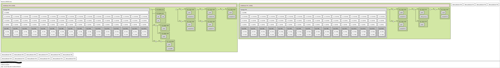
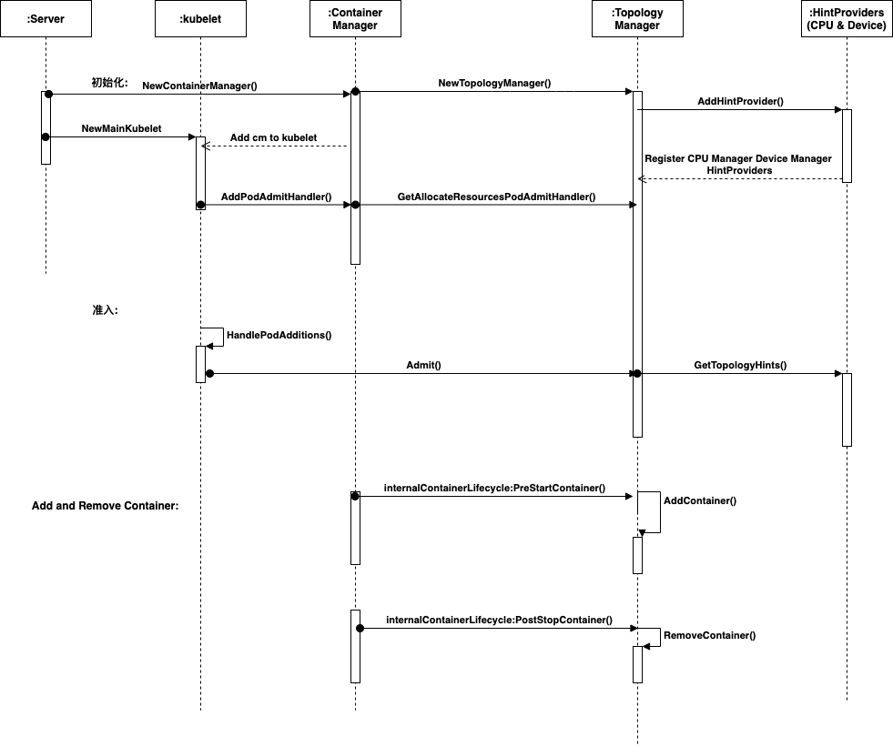

# kubernetes庖丁解牛：kubelet篇 - Topolopy Manager 

> 摘要：越来越多的系统利用 CPU 和硬件加速器的组合来支持对延迟要求较高的任务和高吞吐量的并行计算。为了获得最佳性能，需要进行与 CPU 隔离、内存和设备局部性有关的优化。
> 但在引入拓扑管理器之前，kubelet 中的 cpu manager 和 device manager 相互独立地做出资源分配决策。 这可能会导致在多处理系统上出现并非期望的资源分配；由于这些与期望相左的分配，对性能或延迟敏感的应用将受到影响。这里的不符合期望意指，例如， CPU 和设备是从不同的 NUMA 节点分配的，因此会导致额外的延迟。因为在不同的 numa node 下的 pci 设备进行内存读写时速度与响应时间存在差异，相同的 numa node 节点下的设备与内存的读写效果会更好。


## 如何查看机器的拓扑结构

要理解拓扑管理器首先要了解自己机器的拓扑结构。使用如下命令，可以得到任意一台机器的拓扑结构。

```Shell
sudo yum install hwloc-gui
lstopo tp.png
```

下载tp.png 就可以看到自己机器上拓扑结构。如下所示，是一台60 core 256G机器的拓扑结构。



## 如何开启Topology Manager

Topology Manager 是从kubernetes 1.16 版本开始引入，在1.18版本之后默认开启的。因此如果使用的1.16和1.17 版本需要通过kubelet的特性开关设置TopologyManager=true,启动Topolog Manager功能。

Topology Manager 目前提供四种拓扑对齐策略：

* none: 默认策略，不执行任何拓扑对齐。
* best-effort: 尽最大努力，分配到首选numa节点上，如果没有合适的，也会同意pod加入
* restricted: 如果没有首选numa节点合适，则拒绝pod加入
* single-numa-node: 必须分配到单numa节点上，绝对的不能跨numa。


## Topology Manager 生命周期

```Golang
type Manager interface {
    // PodAdmitHandler is implemented by Manager
    lifecycle.PodAdmitHandler
    // AddHintProvider adds a hint provider to manager to indicate the hint provider
    // wants to be consulted with when making topology hints
    AddHintProvider(HintProvider)
    // AddContainer adds pod to Manager for tracking
    AddContainer(pod *v1.Pod, containerID string) error
    // RemoveContainer removes pod from Manager tracking
    RemoveContainer(containerID string) error
    // Store is the interface for storing pod topology hints
    Store
}

```

Topology Manager 接口共提供了5个方法:

* Admit():当kubelet新增一个pod的时候，会有一串准入检查审核节点目前是否满足运行pod的条件，其中如果用户开启了Topology Manager,准入检查中就会包含Topology 的Admit()否则会单独验证cpu manager和device manager的Allocate()。
* AddHintProvider():添加Hints,目前支持cpu manager 和 topology manager。按照Topology Manager的设计，未来也有可能会增加cni的支持。从上图拓扑架构图中，我们也可以看到，网卡也是区分numa节点的。
* AddContainer():在启动新的容器前，Topology Manager会增加一个容器ID 对应 Pod ID的记录。
* RemoveContainer(): 在删除容器时，删除AddContainer()新增的记录，同时从store中删除s.podTopologyHints[podUID][containerID]的数据
* Store: 用来存储pod分配的拓扑信息。



如上所示是Topology Manager的初始化过程在NewContaienrManager作为kubeDep用作初始化kubelet的时候完成的。在NewMainKubelet的时候同时还会将Topology Manager 的Admit() 注册到kubelet的Pod Admit handler中。

kubelet在sync pod的时候发现pod是新增的，就会进入pod 的准入检查流程，进而会使用到Topology Manager的Admit()方法。

Topology Manager除了提供以上5个方法外，Topology Manager 还提供了两个接口的实现:Container Scope Topology Manager 和 Pod Scope Topology Manager。两个实现使用哪个，主要由kubelet启动时参数--topology-manager-scope决定:

* Container Scope Topology Manager: 在获取CPU Manager和Device Manager的hints时，会提供 pod 和 container信息，因而两者返回的也是contaienr的hints信息。
* Pod Scope Topology Manager: 在获取CPU Manager和Device Manager的hints时，只会提供信息，因而两者会将pod内所有container的cpu set 或者 device 组合到一起再返回。


## 关键代码解析

###### Topology Manager 初始化

```Golang
// NewManager creates a new TopologyManager based on provided policy and scope
func NewManager(topology []cadvisorapi.Node, topologyPolicyName string, topologyScopeName string) (Manager, error) {
    klog.Infof("[topologymanager] Creating topology manager with %s policy per %s scope", topologyPolicyName, topologyScopeName)

    var numaNodes []int
    for _, node := range topology {
        numaNodes = append(numaNodes, node.Id)
    }

    if topologyPolicyName != PolicyNone && len(numaNodes) > maxAllowableNUMANodes {
        return nil, fmt.Errorf("unsupported on machines with more than %v NUMA Nodes", maxAllowableNUMANodes)
    }

    var policy Policy
    switch topologyPolicyName {

    case PolicyNone:
        policy = NewNonePolicy()

    case PolicyBestEffort:
        policy = NewBestEffortPolicy(numaNodes)

    case PolicyRestricted:
        policy = NewRestrictedPolicy(numaNodes)

    case PolicySingleNumaNode:
        policy = NewSingleNumaNodePolicy(numaNodes)

    default:
        return nil, fmt.Errorf("unknown policy: \"%s\"", topologyPolicyName)
    }

    var scope Scope
    switch topologyScopeName {

    case containerTopologyScope:
        scope = NewContainerScope(policy)

    case podTopologyScope:
        scope = NewPodScope(policy)

    default:
        return nil, fmt.Errorf("unknown scope: \"%s\"", topologyScopeName)
    }

    manager := &manager{
        scope: scope,
    }

    return manager, nil
}
```

初始化Topology Manager时需要提供 cadvisor采集的节点信息、拓扑分配策略和拓扑分配范围。初始化时，首先会根据节点信息计算节点共包含多少numa节点。然后根据拓扑分配策略分别初始化不同的Topology Policy。然后根据启动时指定的--topology-manager-scope参数，分别初始化不同的Scope。container scope 和 pod scope的差别在上面已经介绍过了。四种拓扑对齐策略，将会在下面介绍。


###### TopologyHint 与 BitMask

* BitMask

BitMask 被称为位掩码,由一串二进制数字组成，提供按位操作。在Topology Manager中，使用uint64存储BitMask，并提供如下常见位操作方法:


```Golang
type BitMask interface {
    //Add方法：1 左移 bit 位后,按位 or 运算
    Add(bits ...int) error
    //Remove方法: 1 左移 bit 位后,按位清空运算(AND NOT),x&^y ,如果ybit位上的数是0则取x上对应位置的值， 如果ybit位上为1则结果位上取0
    Remove(bits ...int) error
    //And方法: 做按位 and 运算
    And(masks ...BitMask)
    //Or方法: 做按位 or 运算
    Or(masks ...BitMask)
    //Clear方法: 所有位置0
    Clear()
    //Fill()方法: 所有位置1
    Fill()
    //IsEqual方法: 判断 是否等于给定的mask
    IsEqual(mask BitMask) bool
    //IsEmpty方法: 判断 mask是否等于0
    IsEmpty() bool
    //IsSet方法: 检查mask中第bit位是否设置为1
    IsSet(bit int) bool
    //AnySet方法: 检查mask中是否有任何以为在bits中提供的位置被设置为1
    AnySet(bits []int) bool
    //IsNarrowerThan方法:如果maskA比maskB的count小，则maskA比maskB更窄。如果maskA的count等于maskB，则比较maskA和maskB的大小，更小的更窄。
    IsNarrowerThan(mask BitMask) bool
    //String方法: 输出mask的二进制表示
    String() string
    //Count方法: 统计mask中1的个数
    Count() int
    //GetBits方法: 返回位为1的位号
    GetBits() []int
}

type bitMask uint64
```

* TopologyHint

TopologyHint 用来表示容器的numa节点亲和性：

* NUMANodeAffinity: 存储numa节点亲和度，是一个bitmask类型。其含义表示容器更倾向于运行在哪个numa节点上。比如在一个还有2个numa节点的机器上。NUMANodeAffinity共有三种表示方法：
  * 01: 表示容器对节点0亲和，对节点1不亲和
  * 10: 表示容器对节点1亲和，对节点0不亲和
  * 11: 表示容器对节点0 和 节点 1 都亲和

而Preferred空着NUMANodeAffinity是否生效，如果Preferred等于true，说明NUMANodeAffinity的亲和度是有效的，否则是无效的。

```Golang
// TopologyHint is a struct containing the NUMANodeAffinity for a Container
type TopologyHint struct {
    NUMANodeAffinity bitmask.BitMask
    // Preferred is set to true when the NUMANodeAffinity encodes a preferred
    // allocation for the Container. It is set to false otherwise.
    Preferred bool
}
```

###### 四种拓扑对齐策略

如上所述，kubelet在新增pod时，会做pod的拓扑亲和性准入检查，即调用Topology Manager的Admit()方法。这里以containerScope的代码分析Admit的流程，并介绍Topology Manager提供的四种拓扑对齐策略差异:

```Golang
func (s *containerScope) Admit(pod *v1.Pod) lifecycle.PodAdmitResult {
	// Exception - Policy : none
	if s.policy.Name() == PolicyNone {
		return s.admitPolicyNone(pod)
	}

	for _, container := range append(pod.Spec.InitContainers, pod.Spec.Containers...) {
        // 1. 获取最优拓扑对齐建议
        bestHint, admit := s.calculateAffinity(pod, &container)
        //2.  如果拓扑对齐策略，没有通过的拓扑对齐建议，返回异常
        if !admit {
			return topologyAffinityError()
		}
        // -------- 省略部分非核心代码-----------
        //3. 保存通过的最优拓扑对齐建议
        (s.podTopologyHints)[string(pod.UID)][container.Name] = bestHint
        //4. 调用HintProvider,根据得到的拓扑对齐建议分配cpu或者device
        err := s.allocateAlignedResources(pod, &container)
		if err != nil {
			return unexpectedAdmissionError(err)
		}
	}
	return admitPod()
}
```

如果没有指定拓扑对齐策略(即拓扑对齐策略为none)，则Admit直接返回true。其他三种拓扑对齐策略都需要先执行calculateAffinity()方法计算拓扑亲和性,然后调用allocateAlignedResources方法让HintProvider分配资源。

```Golang
//calculateAffinity计算拓扑亲和性
func (s *containerScope) calculateAffinity(pod *v1.Pod, container *v1.Container) (TopologyHint, bool) {
	providersHints := s.accumulateProvidersHints(pod, container)
	bestHint, admit := s.policy.Merge(providersHints)
	klog.Infof("[topologymanager] ContainerTopologyHint: %v", bestHint)
	return bestHint, admit
}

//accumulateProvidersHints 获取每个HintProvider给出的拓扑建议
func (s *containerScope) accumulateProvidersHints(pod *v1.Pod, container *v1.Container) []map[string][]TopologyHint {
	var providersHints []map[string][]TopologyHint

	for _, provider := range s.hintProviders {
		// Get the TopologyHints for a Container from a provider.
		hints := provider.GetTopologyHints(pod, container)
		providersHints = append(providersHints, hints)
		klog.Infof("[topologymanager] TopologyHints for pod '%v', container '%v': %v", format.Pod(pod), container.Name, hints)
	}
	return providersHints
}
```

calculateAffinity方法在计算拓扑亲和性时，首先需要获取每个HintProvider给出的拓扑建议。然后对这些建议做一次和合并整合，得出最后的结论。

* CPU Manager和Device Manager 如何提供 TopologyHint，给出拓扑建议
  
```Golang
func (p *staticPolicy) GetTopologyHints(s state.State, pod *v1.Pod, container *v1.Container) map[string][]topologymanager.TopologyHint {
	//-------省略非核心代码--------
	if allocated, exists := s.GetCPUSet(string(pod.UID), container.Name); exists {
        //-------省略非核心代码--------
        //container 之前已经分配了cpu cores，并且核数等于容器申请的,用这些已经申请的核心的计算TopologyHint，给出建议
		return map[string][]topologymanager.TopologyHint{
			string(v1.ResourceCPU): p.generateCPUTopologyHints(allocated, cpuset.CPUSet{}, requested),
		}
	}

    //如果container 之前没有分配cpu cores，则从可用的cpu cores中计算TopologyHint，给出建议
	// Get a list of available CPUs.
	available := p.assignableCPUs(s)

	// Get a list of reusable CPUs (e.g. CPUs reused from initContainers).
	// It should be an empty CPUSet for a newly created pod.
	reusable := p.cpusToReuse[string(pod.UID)]

	// Generate hints.
	cpuHints := p.generateCPUTopologyHints(available, reusable, requested)
	klog.Infof("[cpumanager] TopologyHints generated for pod '%v', container '%v': %v", format.Pod(pod), container.Name, cpuHints)

	return map[string][]topologymanager.TopologyHint{
		string(v1.ResourceCPU): cpuHints,
	}
}
```

CPU Manger 给出拓扑建议时，会分两种情况。

*  static policy 中已经存在给定的pod和container的cpu 分配记录

此时cpu manager 会根据记录中cpu cores计算拓扑建议。这种情况一般只会发生在kubelet重启的时候。因为kubelet重启之后，主机上已经存在的pod，也会重新走一次add pod和admint的流程。
*  static policy 不存在给定的pod和container的cpu 分配记录

当cpu manager中不选在分配记录，此时cpu manager就会从现在还没有分配出去的cpu cores中计算出可行的拓扑建议。

下面结合generateCPUTopologyHints代码，介绍一下CPU Manager是如何计算拓扑建议的。

```Golang
// generateCPUtopologyHints generates a set of TopologyHints given the set of
// available CPUs and the number of CPUs being requested.
//
// It follows the convention of marking all hints that have the same number of
// bits set as the narrowest matching NUMANodeAffinity with 'Preferred: true', and
// marking all others with 'Preferred: false'.
func (p *staticPolicy) generateCPUTopologyHints(availableCPUs cpuset.CPUSet, reusableCPUs cpuset.CPUSet, request int) []topologymanager.TopologyHint {
	// Initialize minAffinitySize to include all NUMA Nodes.
	minAffinitySize := p.topology.CPUDetails.NUMANodes().Size()

	// Iterate through all combinations of numa nodes bitmask and build hints from them.
    hints := []topologymanager.TopologyHint{}
    // 1. 遍历所有的位掩码的可能组合，寻找合适的拓扑建议。例如一台主机有2个numa节点，则这里会遍历 mask 分别位: 01,10,11 三种情况。
	bitmask.IterateBitMasks(p.topology.CPUDetails.NUMANodes().ToSlice(), func(mask bitmask.BitMask) {
        // 2. 计算主机在mask上的cpu核数，如果cpu 核数大于容器申请的，则将minAffinitySize更新为mask.Count() 
		cpusInMask := p.topology.CPUDetails.CPUsInNUMANodes(mask.GetBits()...).Size()
		if cpusInMask >= request && mask.Count() < minAffinitySize {
			minAffinitySize = mask.Count()
		}

		// Then check to see if we have enough CPUs available on the current
        // numa node bitmask to satisfy the CPU request.
        //3. 计算在给定的mask(numa节点)上，是否有足够的可用的cpu cores
        numMatching := 0
        //4. 首先计算pod上可重用的cpu cores 是否在给定的mask上
		for _, c := range reusableCPUs.ToSlice() {
			// Disregard this mask if its NUMANode isn't part of it.
			if !mask.IsSet(p.topology.CPUDetails[c].NUMANodeID) {
				return
			}
			numMatching++
		}

		// Finally, check to see if enough available CPUs remain on the current
        // NUMA node combination to satisfy the CPU request.
        //5. 计算主机可用cpu cores 是否在给定的mask上。
		for _, c := range availableCPUs.ToSlice() {
			if mask.IsSet(p.topology.CPUDetails[c].NUMANodeID) {
				numMatching++
			}
		}

        // If they don't, then move onto the next combination.
        // 6. 如果mask上可用的cpu 核数小于容器申请的，则过滤掉，否则加入拓扑建议中。
		if numMatching < request {
			return
		}

		// Otherwise, create a new hint from the numa node bitmask and add it to the
		// list of hints.  We set all hint preferences to 'false' on the first
		// pass through.
		hints = append(hints, topologymanager.TopologyHint{
			NUMANodeAffinity: mask,
			Preferred:        false,
		})
    })
    // Loop back through all hints and update the 'Preferred' field based on
	// counting the number of bits sets in the affinity mask and comparing it
	// to the minAffinitySize. Only those with an equal number of bits set (and
    // with a minimal set of numa nodes) will be considered preferred.
    //7. 遍历所有给出的拓扑建议，将跨numa节点最少的建议，标示为首选的拓扑建议
	for i := range hints {
		if hints[i].NUMANodeAffinity.Count() == minAffinitySize {
			hints[i].Preferred = true
		}
	}

    return hints
}
```
总结上述流程如下：

1. 遍历所有的位掩码的可能组合，寻找合适的拓扑建议。例如一台主机有2个numa节点，则这里会遍历 mask 分别位: 01,10,11 三种情况。
2. 计算主机在mask(例如mask=01，计算numa 1 节点)上的cpu核数，如果cpu 核数大于容器申请的，则将minAffinitySize更新为mask.Count().minAffinitySize记录在整机空闲情况下满足容器申请的cpu和数，可适用的最下numa节点个数。
3. 计算在给定的mask(例如mask=01，计算numa 1 节点)上，是否有足够的可用的cpu cores。
   3.1.  首先计算pod上可重用的cpu cores 是否在给定的mask(例如mask=01，计算numa 1 节点)上
   3.2.  计算主机可用cpu cores 是否在给定的mask(例如mask=01，计算numa 1 节点)上
4. 如果mask(例如mask=01，计算numa 1 节点)上可用的cpu 核数小于容器申请的，则过滤掉，否则加入拓扑建议中。 
5. 遍历所有给出的拓扑建议，将跨numa节点最少的建议，标示为首选的拓扑建议  

Device Manager 计算 拓扑建议的流程和CPU Manger计算拓扑建议的流程大致相似，这里就不做详细介绍。


在Topology Manager分别从CPU Manger和Device Manager获取拓扑分配建议之后，然后会对这些建议做合并整理的工作，找到一个最合适的拓扑分配方案。none 拓扑对齐策略前面已经介绍过了，下面介绍剩下三种拓扑对齐策略。

* bestEffortPolicy: 尽力对齐

```Golang
func (p *bestEffortPolicy) Merge(providersHints []map[string][]TopologyHint) (TopologyHint, bool) {
	filteredProvidersHints := filterProvidersHints(providersHints)
	bestHint := mergeFilteredHints(p.numaNodes, filteredProvidersHints)
	admit := p.canAdmitPodResult(&bestHint)
	return bestHint, admit
}
func (p *bestEffortPolicy) canAdmitPodResult(hint *TopologyHint) bool {
	return true
}
```

bestEffortPolicy Merge方法首先会过滤掉一下没有实质内容的拓扑建议，然后对过滤后剩下的拓扑建议做合并整理工作。但是无论最后得出的拓扑建议是什么样的，bestEffortPolicy都会通过改建议。

* restrictedPolicy: 无首选拓扑，则拒绝pod加入

```Golang
func (p *restrictedPolicy) canAdmitPodResult(hint *TopologyHint) bool {
	return hint.Preferred
}

func (p *restrictedPolicy) Merge(providersHints []map[string][]TopologyHint) (TopologyHint, bool) {
	filteredHints := filterProvidersHints(providersHints)
	hint := mergeFilteredHints(p.numaNodes, filteredHints)
	admit := p.canAdmitPodResult(&hint)
	return hint, admit
}
```

restrictedPolicy Merge方法同样也会过滤没有实质内容的拓扑建议，然后对过滤后剩下的拓扑建议做合并整理工作。但是restrictedPolicy要求最后给出的建议必须是一个首选的。什么是首选呢。

> 首选拓扑结构: 容器申请的cpu cores必须要在最少的numa节点上分配。例如 一台主机有2个numa节点，每个numa节点有4core。如果一个容器申请 2 core，则首选建议就是这个容器只能在单numa节点上分配。如果容器申请6core，则首选建议就是这个容器可以在2个numa节点上分配。

* singleNumaNodePolicy: 容器必须分配到单numa节点上。

```Golang
// Return hints that have valid bitmasks with exactly one bit set.
func filterSingleNumaHints(allResourcesHints [][]TopologyHint) [][]TopologyHint {
	var filteredResourcesHints [][]TopologyHint
	for _, oneResourceHints := range allResourcesHints {
		var filtered []TopologyHint
		for _, hint := range oneResourceHints {
			if hint.NUMANodeAffinity == nil && hint.Preferred {
				filtered = append(filtered, hint)
			}
			if hint.NUMANodeAffinity != nil && hint.NUMANodeAffinity.Count() == 1 && hint.Preferred {
				filtered = append(filtered, hint)
			}
		}
		filteredResourcesHints = append(filteredResourcesHints, filtered)
	}
	return filteredResourcesHints
}

func (p *singleNumaNodePolicy) Merge(providersHints []map[string][]TopologyHint) (TopologyHint, bool) {
	filteredHints := filterProvidersHints(providersHints)
	// Filter to only include don't cares and hints with a single NUMA node.
	singleNumaHints := filterSingleNumaHints(filteredHints)
	bestHint := mergeFilteredHints(p.numaNodes, singleNumaHints)

	defaultAffinity, _ := bitmask.NewBitMask(p.numaNodes...)
	if bestHint.NUMANodeAffinity.IsEqual(defaultAffinity) {
		bestHint = TopologyHint{nil, bestHint.Preferred}
	}

	admit := p.canAdmitPodResult(&bestHint)
	return bestHint, admit
}
```

singleNumaNodePolicy 同上一样都会先过滤无用的拓扑建议，但是singleNumaNodePolicy增加了一个filterSingleNumaHints的过程。该方法会在合并整理之前将HintProvider给出的拓扑建议中是首选建议并且只分配到一个numa节点的建议保留，其他的都过滤掉。


上面三种拓扑对齐策略，最后都会对pod做合并整理工作。这部分工作主要由mergeFilteredHints完成，下面结合mergeFilteredHints代码介绍Topology Manger是如何做合并整理，寻找最优的拓扑建议。

```Golang
func mergeFilteredHints(numaNodes []int, filteredHints [][]TopologyHint) TopologyHint {
	// Set the default affinity as an any-numa affinity containing the list
	// of NUMA Nodes available on this machine.
	//1. 初始化defaultAffinity 所有的numa节点都是亲和的。
	defaultAffinity, _ := bitmask.NewBitMask(numaNodes...)

	// Set the bestHint to return from this function as {nil false}.
	// This will only be returned if no better hint can be found when
	// merging hints from each hint provider.
	//2. 初始化bestHint等于defaultAffinity但是不是首选numa节点
	bestHint := TopologyHint{defaultAffinity, false}
	//3. 遍历每一个HintProvider 给出的 可能的 TopologyHint,将这些TopologyHint做and操作，得到最优的hint
	iterateAllProviderTopologyHints(filteredHints, func(permutation []TopologyHint) {
		// Get the NUMANodeAffinity from each hint in the permutation and see if any
		// of them encode unpreferred allocations.
		//3.1 所有的hints做and操作
		mergedHint := mergePermutation(numaNodes, permutation)
		// Only consider mergedHints that result in a NUMANodeAffinity > 0 to
		// replace the current bestHint.
		if mergedHint.NUMANodeAffinity.Count() == 0 {
			return
		}

		// If the current bestHint is non-preferred and the new mergedHint is
		// preferred, always choose the preferred hint over the non-preferred one.
		//3.2 更新bestHint 如果新的hint是首选的，或者新的比bestHint更窄，则更新bestHint等于新的hint
		if mergedHint.Preferred && !bestHint.Preferred {
			bestHint = mergedHint
			return
		}

		// If the current bestHint is preferred and the new mergedHint is
		// non-preferred, never update bestHint, regardless of mergedHint's
		// narowness.
		if !mergedHint.Preferred && bestHint.Preferred {
			return
		}

		// If mergedHint and bestHint has the same preference, only consider
		// mergedHints that have a narrower NUMANodeAffinity than the
		// NUMANodeAffinity in the current bestHint.
		if !mergedHint.NUMANodeAffinity.IsNarrowerThan(bestHint.NUMANodeAffinity) {
			return
		}

		// In all other cases, update bestHint to the current mergedHint
		bestHint = mergedHint
	})

	return bestHint
}
```
总结上述流程如下：
1. 初始化defaultAffinity 对所有的numa节点都是亲和的，例如一个主机还有2个numa节点，则defaultAffinity为11。
2. 初始化bestHint等于defaultAffinity但是不是首选numa节点。
3. 遍历每一个HintProvider 给出的 可能的 TopologyHint,将这些TopologyHint做and操作，得到最优的hint
   1. 所有的hints做and操作
   2. 更新bestHint 如果新的hint是首选的，或者新的比bestHint更窄(更窄的意思是说，拓扑分配跨numa节点更少,优先使用低位的numa节点)，则更新bestHint等于新的hint。