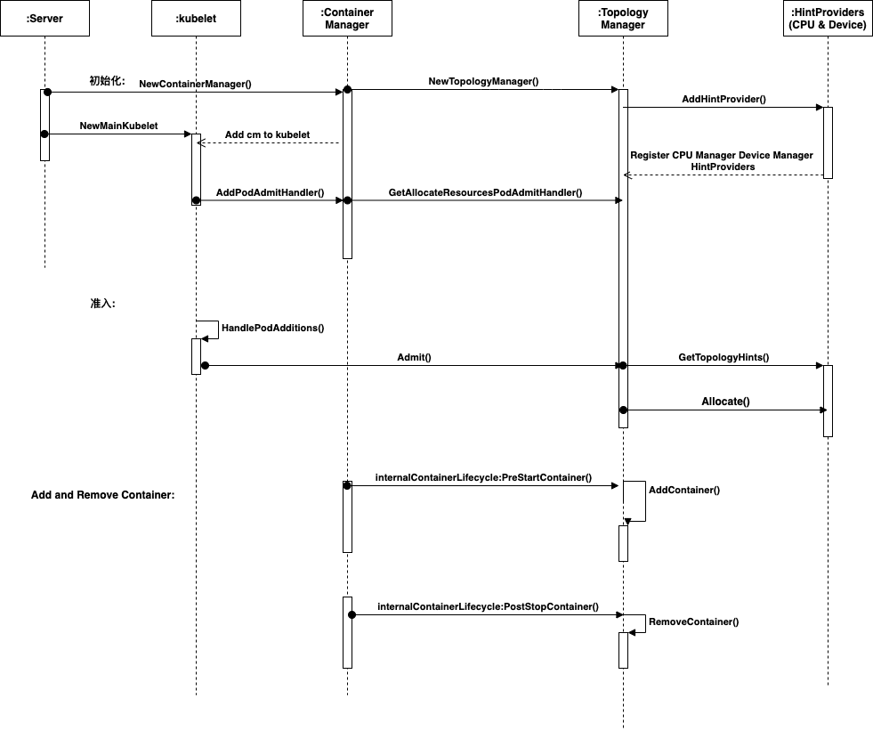

# kubernetes庖丁解牛：kubelet篇 - Topolopy Manager 

> 摘要：越来越多的系统利用 CPU 和硬件加速器的组合来支持对延迟要求较高的任务和高吞吐量的并行计算。为了获得最佳性能，需要进行与 CPU 隔离、内存和设备局部性有关的优化。
> 但在引入拓扑管理器之前，kubelet 中的 cpu manager 和 device manager 相互独立地做出资源分配决策。 这可能会导致在多处理系统上出现并非期望的资源分配；由于这些与期望相左的分配，对性能或延迟敏感的应用将受到影响。这里的不符合期望意指，例如， CPU 和设备是从不同的 NUMA 节点分配的，因此会导致额外的延迟。因为在不同的 numa node 下的 pci 设备进行内存读写时速度与响应时间存在差异，相同的 numa node 节点下的设备与内存的读写效果会更好。


## 如何查看机器的拓扑结构

要理解拓扑管理器首先要了解自己机器的拓扑结构。使用如下命令，可以得到任意一台机器的拓扑结构。

```Shell
sudo yum install hwloc-gui
lstopo tp.png
```

下载tp.png 就可以看到自己机器上拓扑结构。如下所示，是一台60 core 256G机器的拓扑结构。


## 如何开启Topology Manager

Topology Manager 是从kubernetes 1.16 版本开始引入，在1.18版本之后默认开启的。因此如果使用的1.16和1.17 版本需要通过kubelet的特性开关设置TopologyManager=true,启动Topolog Manager功能。

Topology Manager 目前提供四种拓扑对齐策略：

* none: 默认策略，不执行任何拓扑对齐。
* best-effort: 尽最大努力，
* restricted: 
* single-numa-node: 


## Topology Manager 生命周期

```Golang
type Manager interface {
    // PodAdmitHandler is implemented by Manager
    lifecycle.PodAdmitHandler
    // AddHintProvider adds a hint provider to manager to indicate the hint provider
    // wants to be consulted with when making topology hints
    AddHintProvider(HintProvider)
    // AddContainer adds pod to Manager for tracking
    AddContainer(pod *v1.Pod, containerID string) error
    // RemoveContainer removes pod from Manager tracking
    RemoveContainer(containerID string) error
    // Store is the interface for storing pod topology hints
    Store
}

```

Topology Manager 接口共提供了5个方法:

* Admit():当kubelet新增一个pod的时候，会有一串准入检查审核节点目前是否满足运行pod的条件，其中如果用户开启了Topology Manager,准入检查中就会包含Topology 的Admit()否则会单独验证cpu manager和device manager的Allocate()。
* AddHintProvider():添加Hints,目前支持cpu manager 和 topology manager。按照Topology Manager的设计，未来也有可能会增加cni的支持。从上图拓扑架构图中，我们也可以看到，网卡也是区分numa节点的。
* AddContainer():在启动新的容器前，Topology Manager会增加一个容器ID 对应 Pod ID的记录。
* RemoveContainer(): 在删除容器时，删除AddContainer()新增的记录，同时从store中删除s.podTopologyHints[podUID][containerID]的数据
* Store: 用来存储pod分配的拓扑信息。



如上所示是Topology Manager的初始化过程在NewContaienrManager作为kubeDep用作初始化kubelet的时候完成的。在NewMainKubelet的时候同时还会将Topology Manager 的Admit() 注册到kubelet的Pod Admit handler中。

kubelet在sync pod的时候发现pod是新增的，就会进入pod 的准入检查流程，进而会使用到Topology Manager的Admit()方法。

Topology Manager除了提供以上5个方法外，Topology Manager 还提供了两个接口的实现:Container Scope Topology Manager 和 Pod Scope Topology Manager。两个实现使用哪个，主要有kubelet启动时参数--topology-manager-scope决定:

* Container Scope Topology Manager: 在获取CPU Manager和Device Manager的hints时，会提供 pod 和 container信息，因而两者返回的也是contaienr的hints信息。
* Pod Scope Topology Manager: 在获取CPU Manager和Device Manager的hints时，只会提供信息，因而两者会将pod内所有container的cpu set 或者 device 组合到一起再返回。


## 关键代码解析

###### Topology Manager 初始化


###### TopologyHint 与 BitMask

###### CPU Manager 和 Device Manager 如何提供 TopologyHint

###### 四种拓扑对齐策略