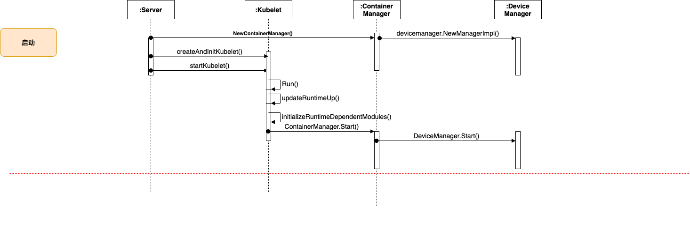

# kubernetes庖丁解牛：kubelet篇 - Device Manager 

> 摘要: kubernetes中定义node的资源默认只包括：CPU、Memory、Pods、hugepages、ephemeral-storage等。但实际上服务器上的设备不仅仅只包括这些。并且随着机器学习，人工智能的发展，服务器上越来越多的插入支持并行计算的设备，例如GPU、FPGA和一些厂商自研的芯片。为解决更多设备如何对kubernetes暴露并使用，并能和kubernetes解耦提升kubernetes代码的稳定性，提出了[Device Manager Proposal](https://github.com/kubernetes/community/blob/master/contributors/design-proposals/resource-management/device-plugin.md).




## Device Manager 初始化

如上图所示，Device Manager的初始化和启动是跟随Container Manager完成的。

```Golang
// NewManagerImpl creates a new manager.
func NewManagerImpl(topology []cadvisorapi.Node, topologyAffinityStore topologymanager.Store) (*ManagerImpl, error) {
	return newManagerImpl(pluginapi.KubeletSocket, topology, topologyAffinityStore)
}
```

Device Manager初始化时，需要提供节点的numa拓扑结构(topology)和拓扑关系存储查询接口(topologyAffinityStore)，以及Device Manager RPC Server的unix socket 接口的位置(pluginapi.KubeletSocket)。

* numa拓扑结构，统计节点的numa节点个数，为容器分配设备时提供Topology hints。
* 拓扑关系存储查询接口，为容器分配设备时，检查是否已经做过Topology hints。
* Device Manager RPC Server的unix socket 接口的位置目前是硬编码到代码中的，位置是：/var/lib/kubelet/device-plugins/kubelet.sock

```Golang
// Start starts the Device Plugin Manager and start initialization of
// podDevices and allocatedDevices information from checkpointed state and
// starts device plugin registration service.
func (m *ManagerImpl) Start(activePods ActivePodsFunc, sourcesReady config.SourcesReady) error {
    //--------省略部分不重要代码--------

	// Loads in allocatedDevices information from disk.
	err := m.readCheckpoint()
	if err != nil {
		klog.Warningf("Continue after failing to read checkpoint file. Device allocation info may NOT be up-to-date. Err: %v", err)
	}

    //--------省略部分不重要代码--------

	s, err := net.Listen("unix", socketPath)
	if err != nil {
		klog.Errorf(errListenSocket+" %v", err)
		return err
	}

	m.wg.Add(1)
	m.server = grpc.NewServer([]grpc.ServerOption{}...)

	pluginapi.RegisterRegistrationServer(m.server, m)
	go func() {
		defer m.wg.Done()
		m.server.Serve(s)
	}()

	klog.V(2).Infof("Serving device plugin registration server on %q", socketPath)

	return nil
}
```

Device Manager启动的时候，首先会加载checkpoint文件中内容，然后启动一个RPC Server。

### checkpoint文件

checkpoint文件记录了Device Manager模块注册的资源列表和Device Manager为每个container分配的资源信息。

```Golang
// Data holds checkpoint data and its checksum
type Data struct {
	Data     checkpointData
	Checksum checksum.Checksum
}
// checkpointData struct is used to store pod to device allocation information
// in a checkpoint file.
// TODO: add version control when we need to change checkpoint format.
type checkpointData struct {
    //PodDeviceEntries 记录为pod中container分配的资源信息。以GPU设备为例会记录如下数据: PodUID->container name -> resource name -> device ID等信息
	PodDeviceEntries  []PodDevicesEntry
    //RegisteredDevices 记录注册的Device
	RegisteredDevices map[string][]string
}
```

checkpoint文件位置: /var/lib/kubelet/device-plugins/kubelet_internal_checkpoint。Device Manager在以下情况下都会更新checkpoint文件的内容:

* 成功为容器分配device
* device plugin 通过ListAndWatch接口更新device状态
* kubelet定期更新node status时，注册的device的数量或者状态发生变化


Device Manager 模块为什么要记录checkpoint文件？主要是在Device Manager重启的时候可以重新加载历史数据。如果不加载历史数据，Device Manager 在为容器分配设备时，会认为所有的设备都没有分配。这样当有新的pod调度到节点上，申请设备的时候，会出现设备重新分配，多个容器共用同一个设备的问题。因此当您出现多个容器共用同一个设备的问题时，你可以排查一下几个方面:

*  kubelet_internal_checkpoint 文件是否丢失
*  kubelet_internal_checkpoint 文件是否出现版本兼容问题

当出现这个问题之后如何修复呢？答案是：把节点上的容器全部重启一下。或者你自己生成正确的kubelet_internal_checkpoint文件，重启kubelet。

### RPC Server


```Golang
service Registration {
	rpc Register(RegisterRequest) returns (Empty) {}
}

message RegisterRequest {
	// Version of the API the Device Plugin was built against
	string version = 1;
	// Name of the unix socket the device plugin is listening on
	// PATH = path.Join(DevicePluginPath, endpoint)
	string endpoint = 2;
	// Schedulable resource name. As of now it's expected to be a DNS Label
	string resource_name = 3;
	// Options to be communicated with Device Manager
	DevicePluginOptions options = 4;
}
```

如上是Device Manager和Device Plugin RPC通信图。Device Manager 的RPC Server 只包含一个接口Register。提供给Device Plugin做插件的服务发现。Device Plugin也需提供一个RPC Server，并提供两个接口ListAndWatch、Allocate。

当Device Plugin 启动时，需要对Device Manager公开的Register接口进行（客户端）gRPC调用。Device Plugin向Device Manager发送RegisterRequest（通过gRPC请求）。Device Manager成功响应请求后，Device Pluging应立即启动自己的RPC Server服务，对外提供ListAndWatch和Allocate接口。

* ListAndWatch接口,当Device Plugin注册成功后，Device Manager会调用Device Plugin的ListAndWatch接口建立长链接，阻塞等待接受Device Plugin传送过来的设备状态。

```Golang
func (e *endpointImpl) run() {
    //调用Device Plugin的ListAndWatch接口
	stream, err := e.client.ListAndWatch(context.Background(), &pluginapi.Empty{})
	if err != nil {
		klog.Errorf(errListAndWatch, e.resourceName, err)

		return
	}

    // 阻塞循环接受Device Plugin的response
	for {
		response, err := stream.Recv()
		if err != nil {
			klog.Errorf(errListAndWatch, e.resourceName, err)
			return
		}

		devs := response.Devices
		klog.V(2).Infof("State pushed for device plugin %s", e.resourceName)

		var newDevs []pluginapi.Device
		for _, d := range devs {
			newDevs = append(newDevs, *d)
		}

		e.callback(e.resourceName, newDevs)
	}
}
```
* Allocate方法: 在为container分配设备时，Device Manager为container分配设别后会调用Allocate方法请求device plugin提供需要mount的设备和添加的ENV。

## 设备的注册

如上所述，设备注册是Device Plugin发起RPC 调用，请求Device Manager的Register 接口，完成Device Plugin的注册。

```Golang
// Register registers a device plugin.
func (m *ManagerImpl) Register(ctx context.Context, r *pluginapi.RegisterRequest) (*pluginapi.Empty, error) {
	klog.Infof("Got registration request from device plugin with resource name %q", r.ResourceName)
	metrics.DevicePluginRegistrationCount.WithLabelValues(r.ResourceName).Inc()
	var versionCompatible bool
	for _, v := range pluginapi.SupportedVersions {
		if r.Version == v {
			versionCompatible = true
			break
		}
	}
	if !versionCompatible {
		errorString := fmt.Sprintf(errUnsupportedVersion, r.Version, pluginapi.SupportedVersions)
		klog.Infof("Bad registration request from device plugin with resource name %q: %s", r.ResourceName, errorString)
		return &pluginapi.Empty{}, fmt.Errorf(errorString)
	}

	if !v1helper.IsExtendedResourceName(v1.ResourceName(r.ResourceName)) {
		errorString := fmt.Sprintf(errInvalidResourceName, r.ResourceName)
		klog.Infof("Bad registration request from device plugin: %s", errorString)
		return &pluginapi.Empty{}, fmt.Errorf(errorString)
	}

	// TODO: for now, always accepts newest device plugin. Later may consider to
	// add some policies here, e.g., verify whether an old device plugin with the
	// same resource name is still alive to determine whether we want to accept
	// the new registration.
	go m.addEndpoint(r)

	return &pluginapi.Empty{}, nil
}
```
如上代码所示主要注册的流程：

* 首先需要校验Device Plugin使用的API Version是否支持。
* 然后校验Device Plugin注册的设备或资源名称是否满足kubernetes要求的扩展资源名称定义的规范。
  * 
* 最后会根据Device Plugin注册的信息，实例一个Endpoint(一个Endpoint 代表一类资源的Device Plugin)，然后启动Endpoint。Endpoint的启动后的工作见上面介绍的RPC Server的 ListAndWatch接口。

## 设备分配

Device Manager 为容器分配设备分两种场景:

* 没有开启Topology Manager功能
* 开启 Topology Manager功能

在 kubelet 没有开启Topology Manager功能的场景下，Device Manager使用Allocate()接口为容器分配设备。

* Device Manager 通过Allocate接口分配设备要求，pod申请的扩展资源的request等于limit。因此扩展资源是无法做超卖。
* Device Manager 通过Allocate接口分配设备时，init container和pod中其他的container是可以共用同一个设备的。
* Device Manager 通过Allocate接口分配设备时，会尽量先给容器分配在同一个numa节点上的设备，如果无法在同一个numa节点上分配，才会出现设备跨numa节点的情况。同时Device Manager 也会调用Device Plugin的GetPreferredAllocation接口，请求Device Plugin给出一个最优分配方案。Device Manager综合Device Plugin和numa节点的方案，给出一个最优的分配方案。
* Device Manager 成功分配出设备后，调用Device Plugin的Allocate方法通知Device Plugin最后将哪些设备分配给该容器，同时Device Plugin也会返回容器需要mount的设备和添加的ENV。
* 以上所有操作完成后，Device Manager更新内存和checkpoint文件，标示设备已经被分配。

> 如上所述，Device Manager在成功分配出设备后，调用Device Plugin的Allocate方法，Device Plugin回容器需要mount的设备和添加的ENV。Device Manager在接收到这些响应只是简单的存储。当container Manager 创建容器时，生成容器的cgroup config的时候，container Manager回再次调用Device Manager的GetDeviceRunContainerOptions接口，Device Manager会调用Device Plugin的PreStartContainer接口，重新获取需要容器需要挂载的目录设别和添加的Env等配置。

关于开启Topology Manager功能时，Device Manager的分配方案可以查看GetTopologyHints接口。其原理和之前的CPU分配方法相似。

## 设备回收

设备分配出去之后，当Pod从node上删除之后，分配给Pod的设备需要回收。Device Manager并没有在container manager的的stop container阶段注入hook。而是在Allocate接口中添加了一段前置逻辑。即每次为container分配设备前，都会做一次回收操作，通过UpdateAllocatedDevices方法回收Device。

```Golang
func (m *ManagerImpl) allocateContainerResources(pod *v1.Pod, container *v1.Container, devicesToReuse map[string]sets.String) error {
	podUID := string(pod.UID)
	contName := container.Name
	allocatedDevicesUpdated := false
	needsUpdateCheckpoint := false
	// Extended resources are not allowed to be overcommitted.
	// Since device plugin advertises extended resources,
	// therefore Requests must be equal to Limits and iterating
	// over the Limits should be sufficient.
	for k, v := range container.Resources.Limits {
		//-------省略不重要代码-------
		// Updates allocatedDevices to garbage collect any stranded resources
		// before doing the device plugin allocation.
		if !allocatedDevicesUpdated {
			m.UpdateAllocatedDevices()
			allocatedDevicesUpdated = true
		}
	}
}

```

UpdateAllocatedDevices方法会删除已经从node上移除的pod的device的分配记录。这样做的优势：设备分配会按照pod分配，当pod上的container重启，不会触发重新分配。例如：GPU服务预测场景下，通常需要将模型加载到显存中。container重启之后，不重新分配设备，就可以减少模型加载时间，提升服务启动的速度。

```Golang
// UpdateAllocatedDevices frees any Devices that are bound to terminated pods.
func (m *ManagerImpl) UpdateAllocatedDevices() {
	activePods := m.activePods()
	if !m.sourcesReady.AllReady() {
		return
	}
	m.mutex.Lock()
	defer m.mutex.Unlock()
	podsToBeRemoved := m.podDevices.pods()
	for _, pod := range activePods {
		podsToBeRemoved.Delete(string(pod.UID))
	}
	if len(podsToBeRemoved) <= 0 {
		return
	}
	klog.V(3).Infof("pods to be removed: %v", podsToBeRemoved.List())
	m.podDevices.delete(podsToBeRemoved.List())
	// Regenerated allocatedDevices after we update pod allocation information.
	m.allocatedDevices = m.podDevices.devices()
}
```
