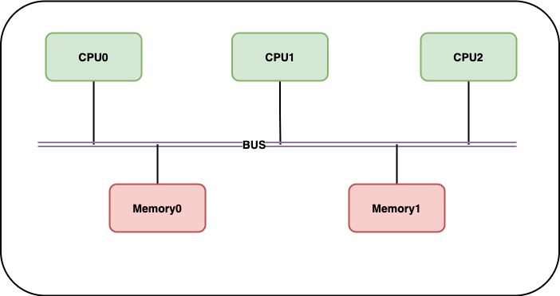
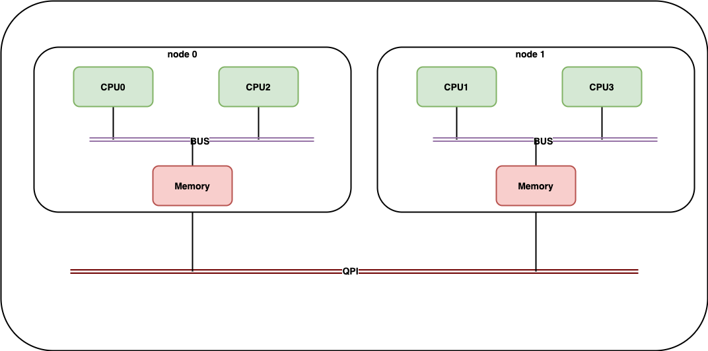
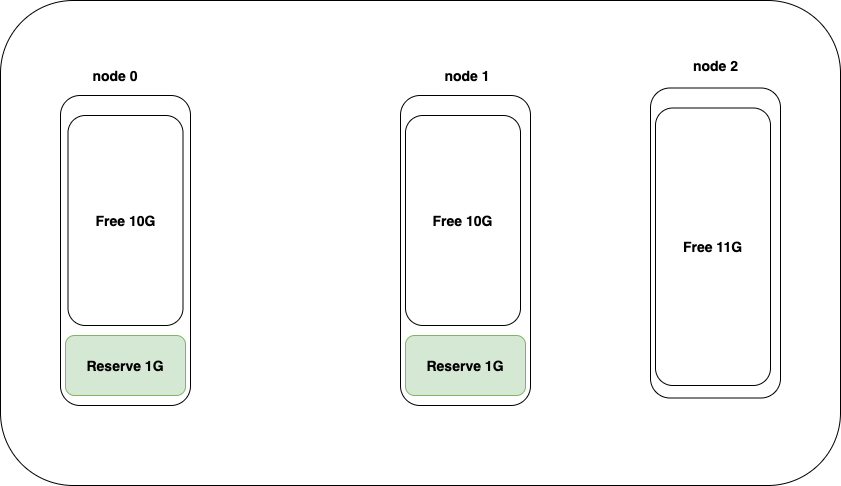
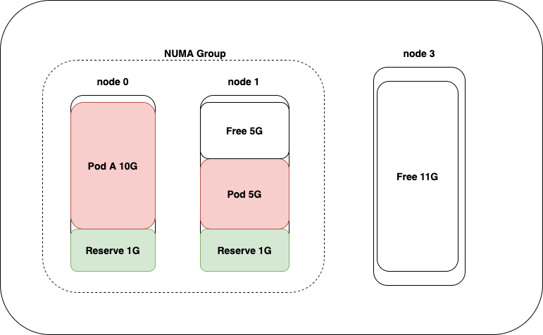
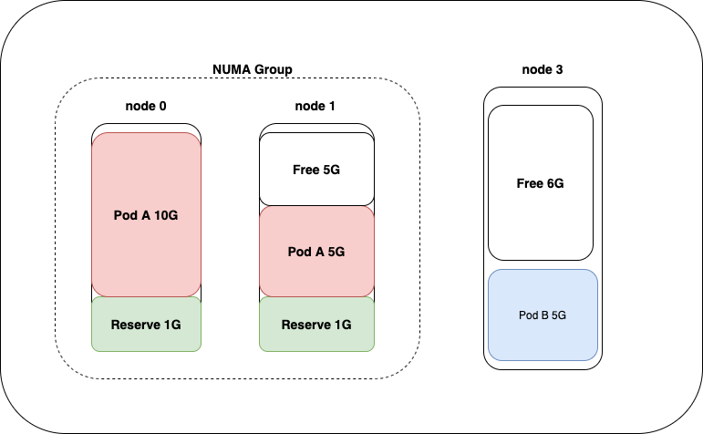
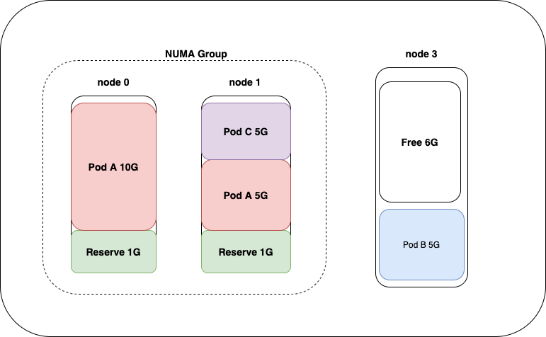
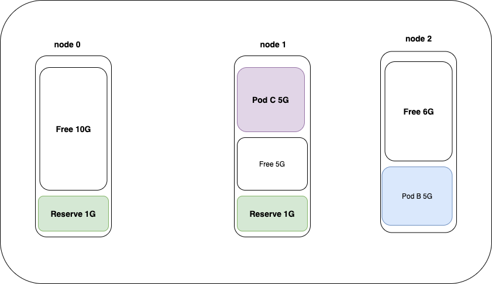

# kubernetes庖丁解牛：kubelet篇 - Memory Manager 

>摘要： Memory Manager是kubernetes 1.21 新增的参与拓扑对齐的设备管理器。Memory Manager模块的对外接口和CPU Manager和Device Manage基本相同。因此Memory Manager在调用和使用上和CPU Manger、Device Manger是保持一致的。

## 什么是NUMA？

现在计算机内存的使用方式都是SMP(Shared Memory MulptiProcessors,共享存储型多处理机模型)。SMP有三种模型：UMA(Uniform Memory Access,统一内存访问)、NUMA(Nonuniform Memory Access,非一致性内存分访问)和COMA(Cache Only Memory Architectur,只用告诉缓存的存储器结构)。现在我们最常听说的就是NUMA的方式了。

那么NUMA是怎么来的呢？在NUMA之前计算机使用的都是UMA的方式。

在UMA模型中，所有CPU对内存的访问都要通过BUS,这样的好处是：物理内存可以被所有的CPU均匀共享，所有CPU对内存的访问时间延迟都是相同的。缺点是：所有访问都要走BUS，BUS成为日后系统扩展的瓶颈，CPU越多，CPU对于内存的访问性能损耗就会越高。

随着现代计算机的发展，CPU越来越多。UMA模型的弊端日益显露。为了解决这些问题，开始有了NUMA模型。

在NUMA模型中，把CPU和临近的内存做成一个node，在node内，CPU可以通过集成内存控制器(IMC，类似BUS)访问内存。跨node的内存访问则需要通过QPI(Quick Path Interconnect)。QPI的延迟要高于IMC,由此CPU对于内存的反问有了远近之别。

## 我们是如何使用NUMA？

有用过NUMA的同学都知道，绑numa的过程就是将进程固定到几个CPU thread上运行。为什么，我们固定了进程运行的CPU thread，就可以显著提升程序的性能。

这个问题的答案就藏在NUMA架构下，内存的分配方式上。在NUMA架构下，内存分配方式有四种模式：

* --localalloc: 从当前node的内存中分配，如果当前node分配不出来了，才会从其他node上分配。local alloc 也是默认的内存分配策略。
* --preferred=node: 优先从指定的node上分配内存，如果指定node分配不出来了，也可以从其他node上分配。
* --membind=nodes: 只能从指定的一个或多个node 上分配内存，如果指定的node分配不出来，会触发进程OOM。
* --interleaved=all: 使用轮询算法轮流的从不同的node上分配内存。

假设我们现在有一个NUMA架构的计算机，其CPU架构如下所示：

当进程不指定NUMA节点运行时，那么在某个时间片，进程的线程有可能运行在CPU0-3上的任意一个thread上的。进程在CPU0/CPU2上运行时，开辟的内存就会在node0上获取。进程在CPU1/CPU3上运行时，开辟的内存就会在node1上获取。由此进程的内存会算乱的分布在多个NUMA节点上。这样带来的一个问题时，进程在运行时，有可能出现大量的跨NUMA节点的内存访问。

当进程启动时，使用numactrl --bindcpu=0 运行，则进程只会运行在CPU0/CPU2上。进程分配的内存大部分都会在node0上。这样就减少了跨NUMA节点的内存访问。

上面我们也提到过，通过QPI的内存延迟要远远高于IMC,公开的数据显示QPI的访问延迟是IMC的三倍。

## Memory Manger 分析

### 使用方式

* kubelet启动时必须为系统预留内存：--reserved-memory={numa-node=0, type=memory, limit=500MB}, {numa-node=1,type=memory, limit=100MB}

* 必须显示开启Memory Manager的特性门：--feature-gates=MemoryManager=true
* 通过--memory-manager-policy参数可以指定Memory Manger的策略，目前支持none和static策略。
  * none策略: memory manager 不提供topology hints。
  * static策略: memory manger 将会为Guaranteed Pod提供topology hints。

### 原理介绍

>这里将会将社区的proposal的原理部分做介绍。大家如果有兴趣也可以研读社区[KEP-1769: Memory Manager
](https://github.com/kubernetes/enhancements/tree/master/keps/sig-node/1769-memory-manager)

* kubelet 对pod做准入检查时，会调用Topology Manager的Admit()方法。
* Topology Manager 之后会调用 MemoryManager的GetTopologyHints方法，获取MemoryManager的拓扑建议。
* Topology Manger综合MemoryManger、CPUManager、DeviceManager的hints，得到besthint。
* Topology Manger获取besthint后，会调用MemoryManger、CPUManager、DeviceManager的Allocate方法，使各模块为容器分配资源。
* 当容器启动时，containerManager会在PreCreateContainer时，通过MemoryManger的GetMemoryNUMANodes方法获取用于分配容器内存的NUMA节点。更新到容器的cgroup config中。之后容器的内存就只能在指定的numa节点上分配。

假设现在我们有3个numa node，每个node 是 11G的内存。kubelet 通过`--reserved-memory={numa-node=0, type=memory, limit=1G}, {numa-node=1,type=memory, limit=1G}`参数，在每个node上预留1G的内存。

**Step 1:** 当kubelet启动后，memory manger的 memory maps的结果如下所示。
> memory maps 记录节点上每种内存(memory/hugepages)的分配情况。

**Step 2:** 我们在该节点上启动一个Guaranteed Pod，Pod A共申请15G内存。此时，由于单NUMA node最多只能分配除10G内存，为了能够给Guaranteed Pod分配出15G内存，memory manage 会讲node0和node1组成一个NUMA Group。

> memory manager 要求numa group是正交的。如果一个node是某个group的成员，则该node不能是其他的group的成员；某个node没有和其他node组成group，则该node也可认为是一个单节点的group。

**Step 3:** 当我们在节点上在启动一个5G内存的Guaranteed Pod B，此时memory Manager会建议优先在node 3上分配内存。

**Step 4:** 当我们在节点上在启动一个limit 5G内存的Besteffort Pod C，该pod就会利用node 1上剩下的5G的内存。其实在Besteffort Pod启动的时候memory manager其实是不工作的，即他不提供topology hints。我们只是认为所有的非Guaranteed Pod都运行在。memory manager没有分配出去的内存碎片上。

**Step 4:** Pod A从节点上删除后，node 0 和 node 1 组成的NUMA Group就会解散。变成各自独立的NUMA node参与内存分配。

